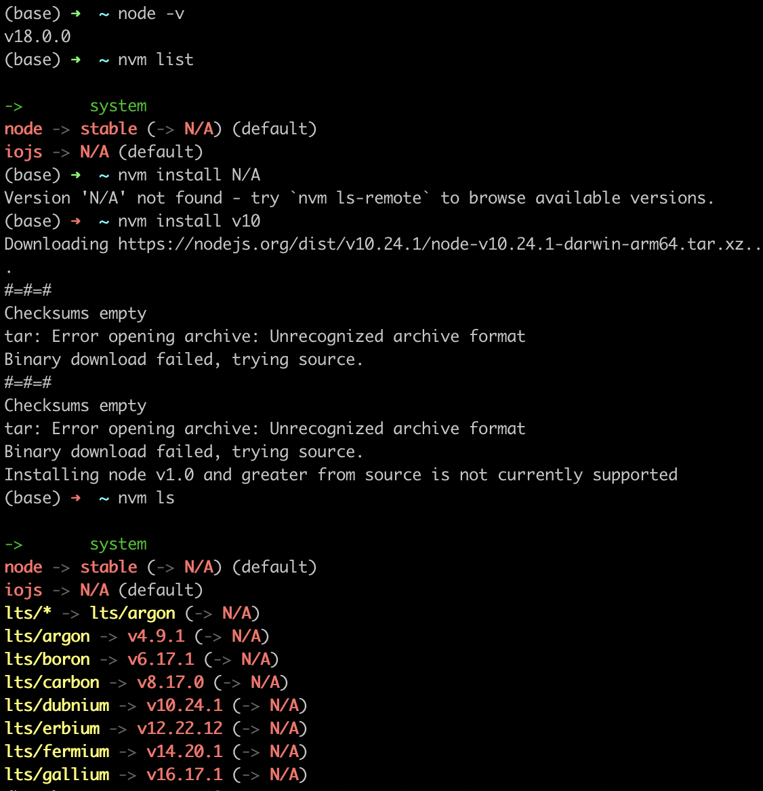

# TEAM 지환 - 1주차 RBF
# Section 3

---

## How the Web Works?

- Client → Request → Server → Response → Client
    - 클라이언트인 브라우저가 서버에 요청을 보냄
    - 서버가 파일을 다룬 후 응답을 클라이언트에게 보냄.
    - 결과적으로 브라우저가 응답을 보여주게 된다.
    

    

## Creating a Node.js Server

- 서버 생성 방법
    
    ```jsx
    import http from 'http';
    const http = http();
    // 함수생성
    function rqListener(req,res) {
    }
    http.createServer(reqListener);
    // 익명함수
    http.createServer(function(req,res) {
    });
    ```
    
- createServer() : 서버를 생성할 때 꼭 필요한 메소드이다.
    - requestListener를 인수로 갖는다.
    - requestListener는  request와 response 두개의 인수를 받는다.  즉, 요청과 응답을 받음.
- listen : node.js가 스크립트를 바로 종료하지 않고 계속 실행되면서 듣도록 한다.  port, hostname, backlog, listeningListener 총 4개의 인수를 받는다 .
    - port : 네트워크 상에서 특정 PC를 나타내는 IP 주소와 그 주소에 진입할 수 있는 정해진 통로
        - 표준 포트 번호들
            -  0번 ~ 1023번: 잘 알려진 포트 (well-known port),사용되고 있는 포트. 따로 사용x
            - 1024번 ~ 49151번: 등록된 포트 (registered port), 벤더가 할당받아 사용하는 포트.
            - 49152번 ~ 65535번: 동적 포트 (dynamic port) , 주로 시스템에 사용하는 포트. 
    - hostname : 기본적으로 localhost를 사용한다.
        - [localhost](http://localhost) : 내 컴퓨터에 할당된 ip주소.

## Node.js & Core Modules

- Windows, Mac, Linux가 다른 형식을 사용하기 때문에 파일 시스템에 있는 파일에 대한 경로를 구축하기 위해 Node.js는 여러 코어 모듈(http, fs, path 등)을 사용한다.
- 코어 모듈은 어떤 파일에서든 사용되고 저장될수있다.
- 사용되는 코어 모듈들
    - http :서버를 출시하거나 요청을 보내는 작업 / 여러 서버간에 소통가능
        - Hyper Text Transfer Protocol : 요청과 응답의 통신 규약
    - https : 서버생성, http 요청 및 응답 작업 / 모든 전송 데이터가 암호화되는 SSL 서버를 출시하기에 용이
        - SSL: 보안소켓계층(Secure Sockets Layer, SSL), 브라우저와 서버 사이의 암호화된 연결을 수립하는 데 사용됩니다.
        - TSL : tls는 ssl의 업데이트 버전이며, ssl3.0을 기반으로 업데이트 됐다.
        - Hyper Text Transfer Protocol Secure : 보안성이 강화된 http
    - fs : FileSystem의 약자, 파일 처리에 관련된 모듈
    - os : 운영체제 확인, 서버의 아키텍쳐를 구분, 서버의 지역 ip를 확인한다.
    - path : 파일 시스템에 있는 파일에 대한 경로를 구축하는 용도
    
    ```jsx
    require('module')
    ```
    

## Requests & Responses

- 요청
    - 요청은 header(메타데이터 + 브라우저가 요청한 데이터 등을 포함하고있음)를 보면 알 수 있다.
    - console.log(req.url, req.method, req.headers)
        - req.url을 통해 호스트 다음에 붙는 모든 주소를 알 수 있다.
        - req.headers : header에 대한 값은 그대로지만, req.method의 출력값이 메서드 get으로 나온다.
- 응답
    - res.setHeader(’Content-Type’, ‘text/html’) ~~새로운 header 속성을 생성할 수 있다.~~
        - Content-Type은 브라우저가 알고 이해하며 받아들이는 디폴트 헤더이다.
        - setHeader 안에 헤더 키에 대응하는 값을 설정하고 text/html에 전송하거나 설정할 수 있다.
        - 이렇게 응답을 하게 되면 , 응답에 헤더(메타데이터)를 붙이게 되고 응답의 콘텐츠 유형은 html이라는 것을 메타정보로 전달하게 된다.
    - res.end() : 응답의 생성이 끝났다는 것을 노드에 알리는 역할을 한다. 이후에 추가로 입력하게 되면 오류가 발생한다.
        
        ```jsx
        const server = http.createServer((req, res) => {
            console.log(req.url, req.method,req.headers); //요청
            //process.exit();
            res.setHeader('Content-Type', 'text/html');   //응답
            res.write('<html>');
            res.write('<head><title>My first page</title></head>');
            res.write('<body><h1>Hello from my Node.js Server!</h1></body>');
            res.write('</head>');
            res.end();
        });
        
        server.listen(3000);
        //요청과 응답이 연결되어 있지 않은 형태이다. 
        ```
        - set header 설정을 안하면 브라우저가 content 유형을 알 수가 없다
        - end가 없으면 응답이 끝나지 않기 때문에 응답을 전송할 수 없게 된다.

- 응답 리디렉션
    
    ```jsx
    const method =req.method;
    if (url ==='/message' && method ==='POST') {
        fs.writeFileSync('message.txt', 'DUMMY');  // 새로운 파일 생성 → 메세지 저장
        //res.writeHead(302,{}) // 한번에 몇가지 메타정보를 설정할 수 있게 함
    		res.statusCode=302; // 경로 재지정
        res.setHeader('Location', '/'); 
        return res.end();
      }
    ```
    
- 요청 본문 분석
    - req.on(’data’, (chunk) ⇒ ) 을 활용해서 특정 이벤트를 들을 수 있도록 함.
    - 첫번째 인자로는 사용할 이벤트를 입력. 이때 이벤트가 발생하는 데에 버퍼가 도움을 줌
    - 두번째 인자로는 모든 데이터 이벤트에 실행될 함수를 넣어주면 됨.
    - chunk 사용해서 상호작용함
    - Buffer.concat(body).toString(); 을 통해서 들어온 버퍼를 문자열로 반환해줌.

## Asynchronous Code & The Event Loop

- node.js는 거의 비동기적으로 작동한다.
    
    
    - 동기: 동시에 일어난다는 뜻, 요청을 하면 시간이 얼마나 걸리던지 요청한 자리에서 결과가 주어져야한다.
    
    - 비동기 : 동시에 일어나지 않는다. 결과가 주어지는데 시간이 걸리더라도 그시간동안 다른 작업을 할수 있으므로 자원을 효율적으로 사용할 수 있는 장점이 있다.

    - Blocking code(동기식 처리): 요청을 보낸 후 응답을 받아야 다음 테스크가 수행되는 것 응답 받기 전까지 이후 테스크들은 블로킹된다.

    - non blocking code(비동기식 처리): 병렬적으로 처리한다. 테스크가 종료되지 않은 상태여도 대기하지 않고 다음 테스크를 실행한다. DOM이벤트 핸들러와 Timer함수, api 요청은 비동기로 처리한다
    
    - 수많은 콜백과 이벤트를 등록해두면 특정 작업이 끝난 후에 Node.js가 해당 코드를 작동시킨다
- Event loop
    - node.js가 시작되면 프로그램에 의해 event loop는 자동으로 실행이 된다 .
    - 모든 콜백을 처리하는데, 콜백을 처리하는데도 일정한 순서가 존재한다.
        - ① Timers : 새로운 반복이 시작될 때 마다 실행해야하는 timer callback이 있는지 확인한다. (setTimeout, setInterval)
        - ② Pending Callbacks : 다른 콜백 함수를 처리한다. 입출력 + 네트워크와 관련된 콜백함수를 처리한다. ( 남은 콜백이 존재할 수 있는데 이 경우는 다음 콜백에서 실행하도록 미룬다고 한다. )
        - ③ Poll : node.js가 새로운 I/O이벤트를 찾아 해당이벤트의 콜백을 빨리 실행하도록 한다 . ( 이 경우에서는 실행을 미루기보다는 대기 콜백으로 등록한다고 한다. )
        - ④ Check : setImmediate이 실행된다. setTimeout, setInterval처럼 바로 실행되기는 하지만 반드시! 열린 콜백이 모두 실행된 다음 실행된다.
        - ⑤ Close Callbacks : 닫혀있는 콜백이 등록되어 있다면 주기의 마지막 단계에서 실행이 진행된다.
        - ⑥ process.exit : 등록한 이벤트 핸들러가 남아 있지 않은지 확인한후 , 프로그램을 종료한다.
    - event loop는 콜백을 다루기 때문에, 빨리 끝낼 수 있는 코드를 포함한 콜백만 다룬다.   (시간이 오래걸리는 파일 연산에는 도움이 되지 않기 때문이다. )
    - 오래 걸리는 연산은 worker pool이 다루게된다. (마찬가지로 node.js가 자동으로 시작하고 관리함.)
        - worker pool은 운영체제와 연관이 있으며, 무거운 작업을 하기 때문에 javascript 코드로부터 완전히 분리된다고 한다.
        - worker가 작업을 마치면 (ex. 파일 읽기) 해당 작업에 대한 콜백이 실행되는데 event loop가 이벤트와 콜백을 책임지기 때문에 결국 이벤트 루프로 들어가게 된다.
- 따라서 JavaScript 스레드는 항상 새 이벤트나 새로 들어오는 요청 등을 다룰 수 있게 된다.
- 더이상 작업이 없을 때는 프로그램이 종료되는데, 서버는 그렇지 않다. (createServe가 절대 끝나지 않는 이벤트에 대한 이벤트 리스너를 등록하기 때문)
- 루프는 계속해서 새로운 이벤트를 기다리다가 이벤트가 발생하면 운영체제가 어떠한 조치를 취할 수 있도록 한 다음 스레드를 비운다. (비동기식 코드 필요)

## 입력되는 데이터에 접근하는 법

- 들어오는 요청은 데이터 스트림에 보내진다.
    - 스트림 : 순차적인 데이터, 처음부터 모든 데이터를 한번에 담는 대신 차례대로 소량의 데이터를 처리해 나가는 처리방식.
    
    ```
    ’‘’JavaScript req.on(’data’,‘실행될 함수’) ’’’
    ```
    
- 데이터이벤트가 발생하는 데에 버퍼가 도움을 준다.
    - 버퍼 : 스트림이 버스라고 한다면 버퍼는 버스정류장. 스트림이 완전히 끝나기 전에 중간에 작업할 수 있게 해준다.

## The Node Module System

- 애플리케이션을 구성하는 개별적 요소기능별로 분리되어 작성

app.js 에서 ES6 문법을 이용해서 routes를 가져옴

```jsx
import routes from './routes';
```

이때,  절대경로를 쓰지말고 상대경로를 사용하여야 함(같은 디렉토리 > ./)

routes에서 전역 객체를 통한 export

```jsx
module.exports = requestHandler;
//exports = requestHandler;

// requestHandler function 작성 생략
```

(node.js가 module을 생략 할 수 있게해줌 === nodejs의 단축키)

# Section 4

---

## npm

- ‘node package manager’npm에서는 새로운 프로젝트의 초기 내용을 설정할 수 있다.
- npm에서는 프로젝트의 의존성(depnedencies) 관리를 돕는다.
- 동시에 package.json을 추가하고 여러 스크립트를 포함할수 있도록 한다.
- 노드 프로젝트 시작 명령어

```
npm init
```

## 3rd Party Packages

- Node 프로젝트는 일반적으로 코어 모듈만을 사용하지 않는다.
- 어떤 용도를 위해 어떤 의존성을 사용하는가를 파악하도록 도와준다.
- –save와 –save-dev는 프로덕션과 개발 의존성을 구분하게 하며 Terminal 내부에서 실행할 수 있다.

```
 npm insall ____(패키지 이름)

//노드몬 설치
npm install nodemon --save-dev

//yarn 노드몬 예시
yarn add -D nodemon

//패키지를 삭제하고 싶을 때
npm uninstall 패키지명
```

- nodemon package
    - 파일 수정 시 자동으로 서버를 재시작해주는 패키지이다. ( + 코드를 수정할 때마다 서버를 종료하고 재시작하는 과정이 필요하지 않게 되는 것이다.)
    - 서버에서 실행중인 앱에 도움이 되는 패키지
    - 개발에 도움이 되는 패키지( Nodemon의 경우 개발 과정에서만 사용한다. )
    - —save : 프로덕션 의존성. 코드안에서 사용하고 작업
    - -dev :단순히 개발 도중 사용
    - -g :전역에 설치, 현재 프로젝트 외에 모든 프로젝트에 적용

    ```
    npm install
    // package.json의 dependencies에 있는 모든 패키지를 설치한다.
    // 처음 프로젝트를 세팅했다면 이 명령어로 패키지를 설치하고 개발을 시작하면 된다.

    npm i
    // npm install 의 줄인 명령어.

    npm install [package]
    // 현재 작업중인 디렉토리 내에 있는 ./node_modules에 [package]를 설치한다.
    // (예: npm install moment) -> ./node_modules에 moment 패키지를 설치 함

    npm install [package] --save
    // [package]를 설치 하면서 package.json파일에 있는 dependencies 객체에 지금 설치한 패키지 정보를 추가한다.

    npm install [package] --save -dev
    // --save옵션과 같이 package.json파일에 의존성 내용을 추가하지만
    // dependencies가 아닌 devDepenencies 객체에 추가한다.

    npm install [package] --no-save
    // dependencies에 패키지 정보를 추가하지 않는다.

    npm install [package] --save-exact
    // 정확히 일치하는 버전의 패키지를 추가한다.

    npm install [package] --save-bundle
    // 해당 패키지를 bundleDependencies에 추가한다.

    npm install [package] --force
    // 해당 패키지가 존재하더라도 원격 저장소에 있는 패키지를 가져온다.
    ```

## Debugging

- VS code 디버거 사용실행중인 코드를 살펴보고 단계별로 진행할수있다.

# Type of Error

1. 구문 오류(Syntax Error): 해결하기 쉬움, 문법 오류 → IDE가 오류난 줄을 알려줌
2. 런타임 에러(Runtime Error): 프로그램을 실행할 때 발생하는 에러
3. 논리적 오류(Logical Error): 오류 메세지가 뜨지 않고 가장 해결하기 어려움 
    1. 중단점을 찍어서 데이터를 확인

# NVM

Node Version Manager(노드 버전 관리자)

## 사용 이유

> 협업 할때/ 다양한 프로젝트를 동시에 진행해야할 때, 라이브러리/프레임워크/개발툴의 버전 호환 문제를 겪는 것을 해결하기 위해
> 

**이점들!**

- 컴퓨터에 다양한 버전의 Node.js 를 설치할 수 있게 해준다.
- use 커맨드를 이용해 사용할 Node 버전으로 간단하게 바꿀 수 있게 해준다.
- 디폴트 버전을 설정하거나 / 설치한 버전들의 전체 리스트를 확인하거나 / 필요 없는 버전을 삭제하는 등등의 버전 관리가 쉬워진다.

## NVM 설치

[https://github.com/nvm-sh/nvm](https://github.com/nvm-sh/nvm)

^ 공식 문서

## NVM 명령어들

```
# node.js 버전 설치하기
$ nvm install 0.10
$ nvm install v0.1.2
$ nvm install v8

# node 최신 버전 설치 (설치 당시 기준)
$ nvm install node

# node LTS 최신버전 설치
$ nvm install --lts

----------------------------

# 설치된 node.js 목록 확인하기
$ nvm ls

# 설치할 수 있는 모든 Node 버전 조회
$ nvm ls-remote

# 특정 버전의 node 사용하기
$ nvm use <version>

# 현재 사용중인 버전 확인하기
$ nvm current

# node.js 설치 경로 확인하기
$ which node

# 필요없는 node 버전 삭제하기
$ nvm uninstall <version>
```

